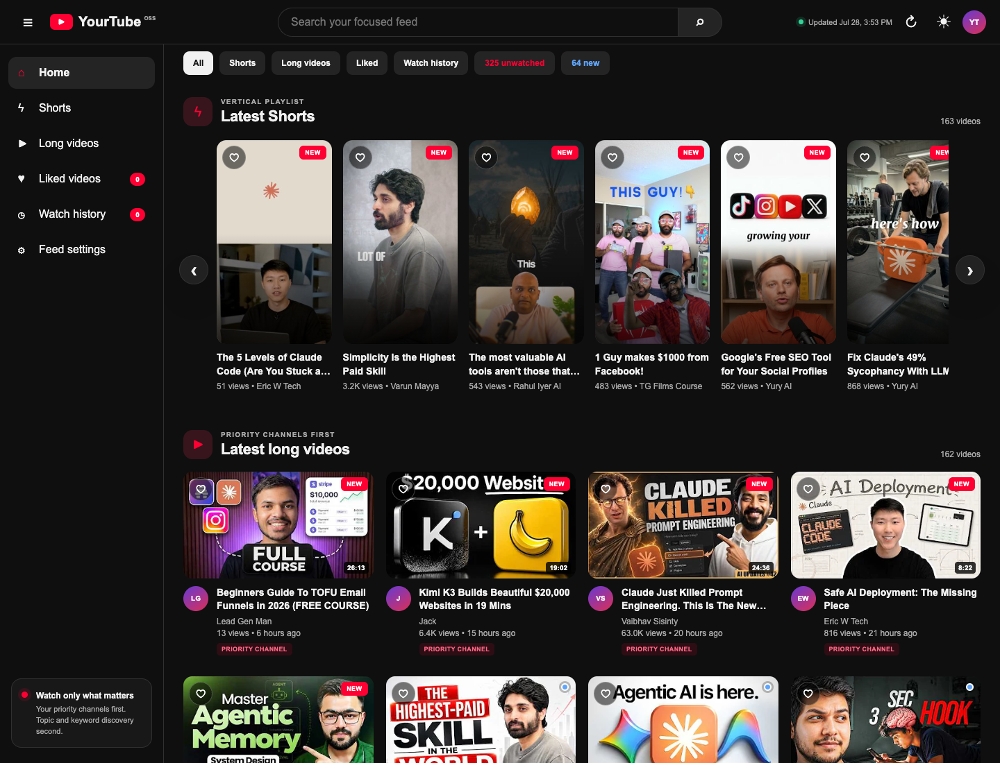
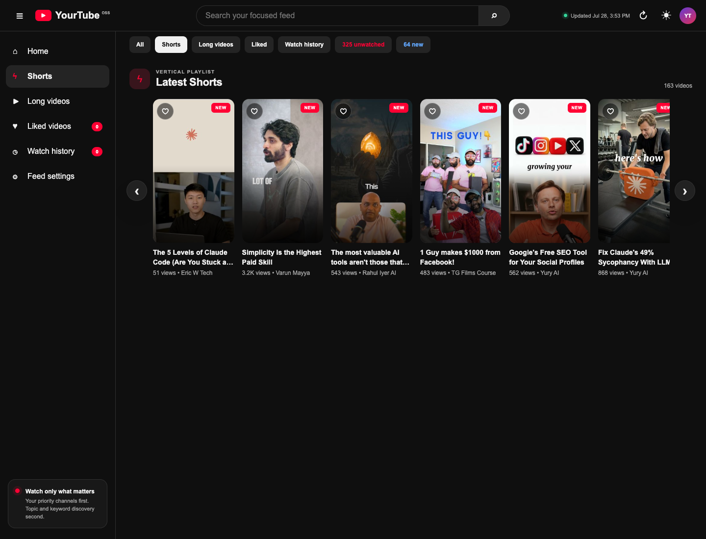
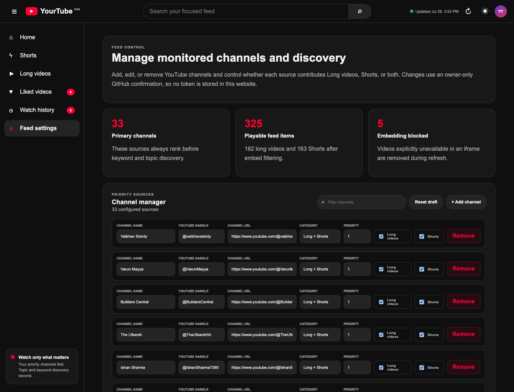

# YourTube - A personal YouTube Package

**Watch only those valuable for you.**

YourTube is a forkable, static, YouTube-style personal feed dashboard. It helps you turn a noisy YouTube habit into a controlled watchlist: your priority channels first, Shorts and long videos separated, watched items hidden from normal queues, and refresh automation that can run from Hermes, Codex, Claude Code, GitHub Actions, normal cron, or a plain terminal.

[](https://developerjillur.github.io/nexafeed/)
[](https://developerjillur.github.io/nexafeed/)
[](#how-it-works)
[](#copy-paste-prompt-for-any-ai-agent)

**Live demo:** https://developerjillur.github.io/nexafeed/

> YourTube is not affiliated with YouTube or Google. It embeds public YouTube videos through the official YouTube iframe player and links back to YouTube for account-level actions.

## Screenshots

| Home feed | Shorts player | Feed Settings |
|---|---|---|
|  |  |  |

## Why this exists

YouTube is good at keeping you watching. It is not always good at helping you watch intentionally.

YourTube was built for people who follow specific creators, topics, and research areas but do not want their feed controlled only by recommendations. The goal is simple: keep the videos that matter, separate Shorts from long videos, remove what you already watched, and make the whole thing easy to run on your own GitHub account.

The default public demo uses the current NexaLance AI/web-development source setup so you can see a real feed immediately. Fork users can replace the channels and discovery terms with their own.

## What you get

| Area | Features |
|---|---|
| Personal feed | Priority channel feed, topic/keyword discovery, category chips, fresh/new indicators |
| Shorts | Dedicated Shorts tab, YouTube-style overlay, next/previous buttons, keyboard navigation, wheel threshold navigation, swipe support |
| Long videos | Full-width watch layout, autoplay queue, progress resume, next playable queue |
| Watch control | Manual skip sends under-threshold videos to an Ignored list, 30-second / half-Short threshold sends meaningful views to Watch History, normal queues hide watched and ignored items |
| Watch history | Browser-local watched/progress/ignored state, Watch History tab, Ignored videos tab, export/import history JSON |
| Local likes | Local favorite/liked state, Liked tab, export likes JSON, clear liked state |
| Feed Settings | Add/edit/remove channels, set long/Shorts monitoring per source, edit keywords/topics/categories, submit owner-reviewed GitHub issue |
| Automation | Runs from Hermes cron, normal cron, Codex, Claude Code, local terminal, or GitHub Actions |
| Provider config | Env-based LLM/provider settings for future AI steps: OpenAI, Anthropic, OpenRouter, Gemini, Groq, Mistral, DeepSeek, xAI, Z.ai/GLM, Ollama, or custom OpenAI-compatible endpoints |
| Static safety | No frontend API keys, no backend required, no YouTube API key in the browser, GitHub Actions SHA-pinned |
| Email reports | Morning and midnight count/link digests through Resend or SMTP from private env only |

## Current default demo setup

The demo at `developerjillur.github.io/nexafeed` ships with the existing AI, automation, coding, marketing, and web-development source setup.

Release snapshot:

- 33 monitored channels
- 325 playable feed items
- 165 long videos
- 160 Shorts
- 285 primary channel items
- 40 topic/keyword/category discovery items
- Asia/Dhaka timezone

Files that define the default setup:

```text
data/channels.csv                         primary monitored channels
data/original-channel-categories.csv      original source/category reference
data/feed-settings.json                   public settings model used by the UI
config.json                               site name, live URL, discovery terms, limits, metadata TTLs
```

## How it works

YourTube is a static GitHub Pages app plus a Python collector.

```text
YouTube public pages/RSS/search
        ↓
scripts/nexafeed_update.py
        ↓
data/videos.json + data/video-details.json + data/feed-settings.json
        ↓
index.html + app.js + style.css on GitHub Pages
```

The browser only reads static JSON and embeds videos with the YouTube iframe API. Secrets stay outside the public site:

- local runs: `.env.local` or `--env-file`
- Hermes runs: `$HERMES_HOME/.env` or `~/.hermes/.env`
- GitHub Actions: repository Secrets and Variables
- public frontend: no secrets

The repository and runtime env names still use `nexafeed` / `NEXAFEED_*` for backward compatibility with the original package path and deployed URL. The public product name is YourTube.

## Watched vs Ignored rules

YourTube keeps playback decisions private in browser `localStorage`:

- If a running video is skipped, closed, changed with keyboard arrows, changed with wheel/scroll, or replaced by another video before the watch threshold, it goes to **Ignored videos**.
- Ignored videos stay out of Home, Shorts, Long videos, fresh/new filters, and Up Next queues.
- If the user watches at least **30 seconds**, the video goes to **Watch history** instead of Ignored.
- For Shorts with a known duration, watching **half of the Short** is enough. Example: a 40-second Short counts as watched after 20 seconds.
- Finishing a video or reaching 80% progress still marks it watched.
- Watched and ignored records are stored locally for the current feed window plus **1 extra day**, then pruned in the browser. This prevents a video from returning as “new” on the next refresh while it is still inside the feed window.
- Browser state is local only. Export history JSON if you want to move watched/progress/ignored state to another device.

## Quick start

```bash
git clone https://github.com/developerjillur/nexafeed.git
cd nexafeed
cp .env.example .env.local
python3 -m pip install --upgrade yt-dlp
python3 scripts/nexafeed_doctor.py
python3 scripts/nexafeed_automation.py --dry-run --no-details --no-secondary --workers 6
```

Preview locally:

```bash
python3 -m http.server 8765
# open http://127.0.0.1:8765/
```

Refresh without publishing:

```bash
python3 scripts/nexafeed_update.py
```

Refresh, commit generated data, and push:

```bash
python3 scripts/nexafeed_automation.py --pull-first --require-clean --publish
```

## Deploy your own live YourTube

1. Fork this repository.
2. Enable GitHub Pages for the repo.
3. Edit `config.json`:

```json
{
  "siteName": "YourTube",
  "tagline": "Watch only those valuable for you",
  "siteUrl": "https://YOUR_GITHUB_USERNAME.github.io/YOUR_REPO/",
  "repositoryUrl": "https://github.com/YOUR_GITHUB_USERNAME/YOUR_REPO"
}
```

4. Keep the default feed or edit `data/channels.csv` and the discovery terms in `config.json`.
5. Push to `main`.
6. Open the Actions tab and run **Update YourTube feed**.
7. Your live URL will be:

```text
https://YOUR_GITHUB_USERNAME.github.io/YOUR_REPO/
```

For this public demo, the live URL is:

```text
https://developerjillur.github.io/nexafeed/
```

## Personalize the feed

You can control the personal feed in two ways.

### Option A: use Feed Settings in the app

1. Open the live site.
2. Go to **Feed Settings**.
3. Add, edit, remove, filter, or reset channel rows.
4. Choose whether each source should monitor long videos, Shorts, or both.
5. Edit keywords, topics, and categories.
6. Click **Review and apply on GitHub**.
7. Submit the prefilled GitHub issue while signed in as the repository owner.
8. GitHub Actions validates the payload, commits the settings, deploys the site, and closes the issue.
9. The next clean refresh rebuilds the feed with your new setup.

The static app never stores a GitHub token in the browser. Settings are applied through an owner-only GitHub Actions workflow.

### Option B: edit files directly

Edit channels:

```text
data/channels.csv
```

Edit discovery terms:

```text
config.json
```

Then run:

```bash
python3 scripts/nexafeed_automation.py --pull-first --require-clean --publish
```

## Environment configuration

Copy the public-safe template:

```bash
cp .env.example .env.local
```

Useful runtime values:

```bash
NEXAFEED_SITE_NAME=YourTube
NEXAFEED_TAGLINE="Watch only those valuable for you"
NEXAFEED_SITE_URL=https://YOUR_GITHUB_USERNAME.github.io/YOUR_REPO/
NEXAFEED_REPOSITORY_URL=https://github.com/YOUR_GITHUB_USERNAME/YOUR_REPO
NEXAFEED_TIMEZONE=Asia/Dhaka
NEXAFEED_BRANCH=main
NEXAFEED_WORKERS=6
```

The current collector does not require an LLM key. Provider settings are included so future AI steps can run without code changes:

```bash
NEXAFEED_LLM_PROVIDER=openrouter
NEXAFEED_LLM_MODEL=openai/gpt-4o-mini
OPENROUTER_API_KEY=your-private-key
```

Generic OpenAI-compatible provider:

```bash
NEXAFEED_LLM_PROVIDER=custom
NEXAFEED_LLM_MODEL=your-model-name
NEXAFEED_LLM_BASE_URL=https://your-provider.example/v1
NEXAFEED_LLM_API_KEY=your-private-key
```

Local Ollama:

```bash
NEXAFEED_LLM_PROVIDER=ollama
NEXAFEED_LLM_MODEL=llama3.1
OLLAMA_HOST=http://127.0.0.1:11434/v1
```

Provider aliases supported by `scripts/nexafeed_env.py`:

```text
openai, anthropic, openrouter, google, gemini, groq, mistral, deepseek, xai, zai, glm, ollama, custom, none
```

Check setup without printing secrets:

```bash
python3 scripts/nexafeed_doctor.py
python3 scripts/nexafeed_doctor.py --require-llm
```

## Schedule recipes

Use only one publisher at a time. If GitHub Actions owns the refresh schedule, pause Hermes/local cron. If Hermes or local cron owns it, keep GitHub Actions manual.

### Normal cron, hourly refresh

```cron
53 * * * * cd /path/to/nexafeed && /usr/bin/python3 scripts/nexafeed_automation.py --pull-first --require-clean --publish >> "$HOME/.yourtube/update.log" 2>&1
```

With a private env file outside the repo:

```cron
53 * * * * cd /path/to/nexafeed && /usr/bin/python3 scripts/nexafeed_automation.py --env-file "$HOME/.config/yourtube.env" --pull-first --require-clean --publish >> "$HOME/.yourtube/update.log" 2>&1
```

### Email digest cron

Morning count/link digest:

```cron
0 10 * * * cd /path/to/nexafeed && /usr/bin/python3 scripts/nexafeed_digest_email.py --period morning --env-file "$HOME/.config/yourtube.env" >> "$HOME/.yourtube/email.log" 2>&1
```

Midnight count/link digest:

```cron
0 0 * * * cd /path/to/nexafeed && /usr/bin/python3 scripts/nexafeed_digest_email.py --period midnight --env-file "$HOME/.config/yourtube.env" >> "$HOME/.yourtube/email.log" 2>&1
```

### Hermes Agent schedule

Open Hermes in the repository and ask it to create these jobs:

```text
Create a Hermes cron job named "YourTube hourly refresh" that runs from this repo every hour at minute 53. It should execute:
python3 scripts/nexafeed_automation.py --pull-first --require-clean --publish

Create a Hermes cron job named "YourTube morning email" that runs daily at 10:00 Asia/Dhaka and executes:
python3 scripts/nexafeed_digest_email.py --period morning

Create a Hermes cron job named "YourTube midnight email" that runs daily at 00:00 Asia/Dhaka and executes:
python3 scripts/nexafeed_digest_email.py --period midnight

Verify with hermes cron status, run a dry-run first, and do not print or commit secrets.
```

Hermes must have its gateway running for scheduled cron jobs to fire automatically:

```bash
hermes cron status
```

### GitHub Actions schedule

The included workflow is manual by default to avoid conflicting with local/Hermes cron. To make GitHub Actions own the schedule, add this to `.github/workflows/update-feed.yml`:

```yaml
on:
  schedule:
    - cron: "53 * * * *"
  workflow_dispatch:
```

Then pause all other publishers.

### Codex, Claude Code, or another coding agent

Give the agent the repo and this command sequence:

```bash
git pull --ff-only origin main
python3 -m pip install --upgrade yt-dlp
python3 scripts/nexafeed_doctor.py
python3 scripts/nexafeed_automation.py --dry-run --no-details --no-secondary --workers 6
python3 scripts/nexafeed_automation.py --pull-first --require-clean --publish
```

## Copy-paste prompt for any AI agent

Paste this into Hermes, Claude Code, Codex, Cursor, or another coding agent after giving it the GitHub repo link:

```text
You are setting up YourTube - A personal YouTube Package.
Tagline: Watch only those valuable for you.

Source repo: https://github.com/developerjillur/nexafeed
Live demo to inspect first: https://developerjillur.github.io/nexafeed/

Goal:
Fork or clone this repo into my GitHub account, keep it public, enable GitHub Pages, and give me a live URL like https://MY_GITHUB_USERNAME.github.io/MY_REPO/.

Rules:
- Do not commit secrets, API keys, tokens, passwords, or local private paths.
- Keep real credentials only in .env.local, an explicit private env file, Hermes env, or GitHub Actions Secrets.
- Keep the NEXAFEED_* env names unless you update all scripts and tests.
- Keep the YouTube iframe/API approach. Do not download or rehost YouTube videos.
- Keep browser-local watch history and local likes unless I ask for a real backend.

Setup steps:
1. Inspect README.md, config.json, data/channels.csv, .env.example, scripts/nexafeed_doctor.py, scripts/nexafeed_automation.py, and .github/workflows/update-feed.yml.
2. Update config.json:
   - siteName: YourTube
   - siteUrl: https://MY_GITHUB_USERNAME.github.io/MY_REPO/
   - repositoryUrl: https://github.com/MY_GITHUB_USERNAME/MY_REPO
3. Keep the default 33-channel AI/web-development feed unless I provide my own channels.
4. If I provide channels, update data/channels.csv and discovery terms in config.json.
5. Run:
   python3 -m pip install --upgrade yt-dlp
   python3 scripts/nexafeed_doctor.py
   python3 scripts/nexafeed_automation.py --dry-run --no-details --no-secondary --workers 6
6. Run verification:
   python3 tests/test_nexafeed_features.py -v
   python3 -m py_compile scripts/*.py
   node --check app.js
   python3 scripts/verify_nexafeed.py
   git diff --check
7. Commit and push.
8. Enable GitHub Pages and run the Update YourTube feed workflow manually.
9. Wait for deploy success and fetch the live URL.
10. Return: repo URL, live URL, what changed, how to refresh, how to edit Feed Settings, and any warnings.
```

Full prompt file: [`docs/AI_SETUP_PROMPT.md`](docs/AI_SETUP_PROMPT.md)

## Verification

```bash
node --check app.js
python3 -m py_compile scripts/*.py
python3 tests/test_nexafeed_features.py -v
python3 scripts/verify_nexafeed.py
python3 scripts/nexafeed_doctor.py --allow-missing-yt-dlp
git diff --check
```

`verify_nexafeed.py` checks dynamic channel consistency, feed stats, source ownership, video IDs, blocked-video leakage, rich metadata coverage, bounded comments, settings parity, public-release docs, screenshots, SHA-pinned Actions, env-template safety, and common credential signatures.

## What YourTube does not do

- It does not post YouTube likes, comments, replies, or subscriptions for you.
- It does not bypass YouTube ads or YouTube player policies.
- It does not sync watch history across devices without a backend.
- It does not store API keys in the browser.
- It does not guarantee a video stays playable forever. YouTube availability can change after a refresh.

## Good GitHub topics for discovery

```text
youtube, youtube-shorts, personal-dashboard, github-pages, static-site, ai-agents, hermes-agent, codex, claude-code, automation, yt-dlp, no-backend, localstorage, feed-reader, productivity, creator-tools, python, javascript, open-source
```

## Share copy

Short launch copy:

```text
I released YourTube - A personal YouTube Package.

Tagline: Watch only those valuable for you.

It gives you a forkable YouTube-style dashboard with priority channels, Shorts, long videos, local watch history, local likes, Feed Settings, and scheduled refresh through Hermes, Codex, Claude Code, cron, or GitHub Actions.

Live demo: https://developerjillur.github.io/nexafeed/
GitHub: https://github.com/developerjillur/nexafeed
```

Hashtags:

```text
#YourTube #YouTubeTools #AIAgents #OpenSource #GitHubPages #Automation #ClaudeCode #Codex #HermesAgent #PersonalDashboard #ProductivityTools #YouTubeShorts
```

## License

MIT License. See [`LICENSE`](LICENSE).
